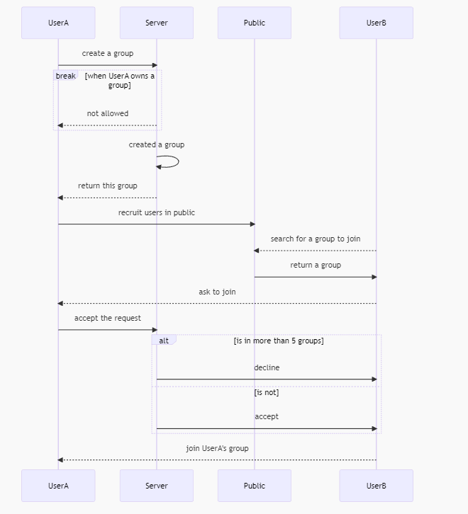
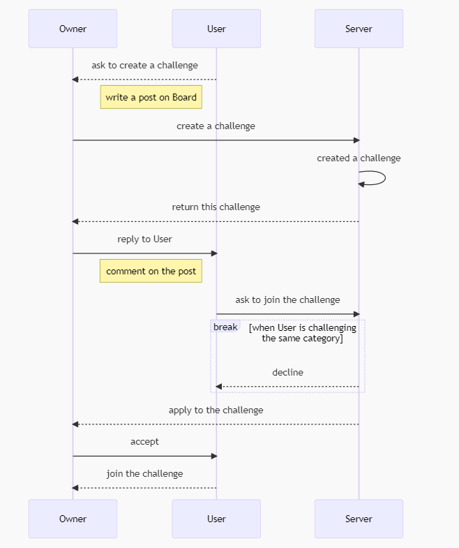
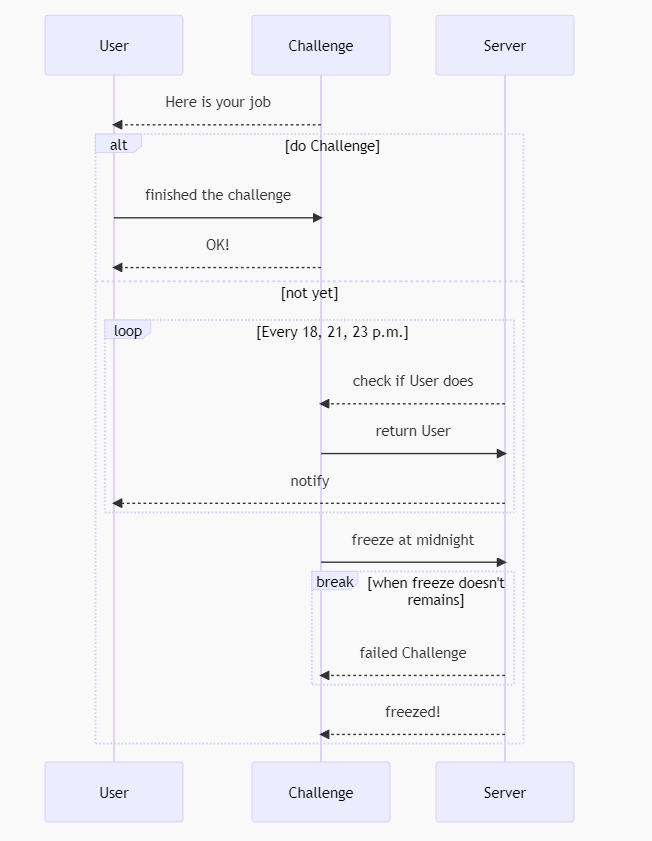
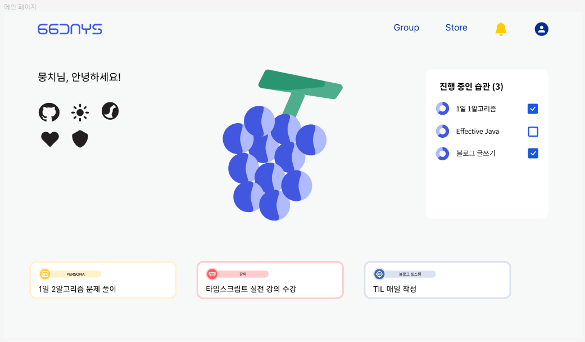

# 66 days

-> **[Notion](https://checker-clavicle-3f2.notion.site/01f13a28c11e44059a9752581920cbc7) 구경가기** 
-> **[우리의 열정! 회의록](https://checker-clavicle-3f2.notion.site/b8cc947fe67c45bea2f91792a5a6380a) 구경가기**

## 목차

1. 서비스 소개
1. 주요 기능
1. 기능명세서
1. Sequence Diagram
1. 기술스택
1. 와이어프레임
1. ERD
1. 과제

## 1. 서비스 소개

- **66 days 란?** 66 days는 새 습관을 만드는데 평균 66일 걸린다는 연구 결과를 바탕으로 개발자들을 위한 습관 만들어 주기 및 습관 관리를 해주기 위한 서비스입니다
- **목표 및 방향성은?** 최소 66일동안 나태, 불안, 슬럼프를 극복하고 동기부여를 받아 알고리즘 풀기, 블로그 작성 등 꾸준히 하기 힘든 과제들을 습관으로 만들 수 있습니다.

## 2. 주요 기능

1. **개인 습관 등록** 
   개발자 개인은 66일 동안 습관으로 만들고 싶은 도전과제를 등록하여 매일 체크합니다. 
2. **그룹 습관 등록** 
   개인으로 습관을 등록하고 도전할 수 있지만 타인과 함께 서로 감시/감독하며 하고 싶다면 그룹에 참여하여 같은 도전을 함께 진행할 수 있습니다. 
3. **채팅** 
   타인과 한 습관 도전과제를 하기로 하고 팀을 꾸렸다면 해당 소그룹 내에서 서로 실시간 채팅을 할 수 있습니다. 
4. **알림** 
   매일 도전을 이어 나가야하며 만약 체크되지 않을 시 유저에게 알림이 갑니다(18시, 21시, 23시)
5. **포인트, 경험치** 
   유저는 스트릭을 이어가고 66일간의 습관 만들기 도전이 완료될 때마다 포인트와 경험치를 얻게 됩니다 
6. **상점** 
   유저는 자신의 아바타 및 마이페이지를 꾸미기 위한 오브젝트와 하루 도전을 하지 않았을 시 이를 방어할 수 있는 개인 프리즈를 상점에서 구매할 수 있습니다.  
7. **랭킹** 
   개인별 연속 스트릭 일수, 경험치량, 완료한 습관 수 별로 서비스 내 전체 유저 랭킹을 제공합니다.

## 3. Sequence Diagram

### 3-1. 그룹에 참여하는 순서

### 3-2. 챌린지에 참여하는 순서

### 3-3. 챌린지 진행 순서

## 4. 기능명세서

- 습관 관련 기능 명세서
  
   

- 포인트, 경험치 관련 기능 명세서
  

- 알림 관련 기능 명세서
  
   
   

### 5. 기술스택

---

## 6. 와이어프레임

- 메인 페이지 
  
- 그룹 검색 페이지 
  
- 마이 페이지 
  
- 습관 페이지 
  

---

## 7. ERD

## 8. 과제

프로젝트 개발에 앞서 직면한 문제점은 크게 세 가지가 있습니다.

- 습관에 대한 랭킹을 매기는 로직을 구체화
- 나와 같은 습관을 진행하는 이들과 매칭을 어떻게 할까
- 내가 획득한 습관 뱃지를 어떻게 UI/UX적으로 와닿게 보여줄까
