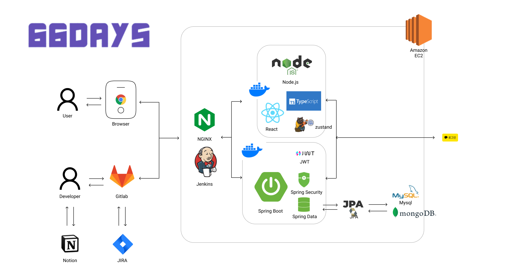
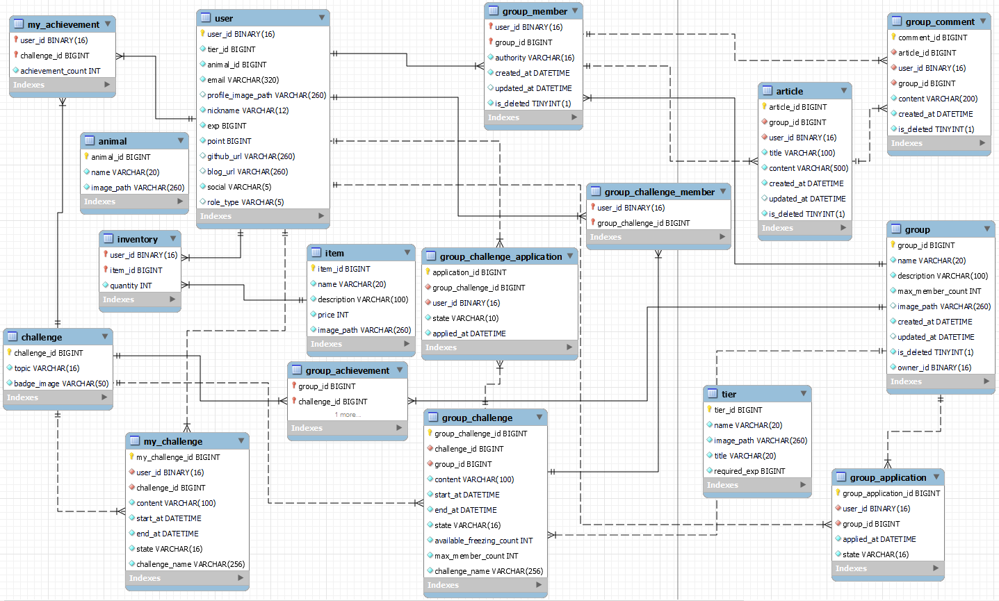
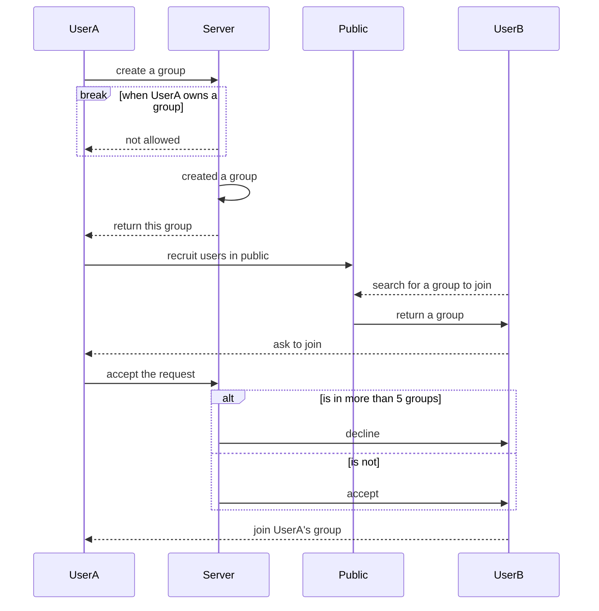
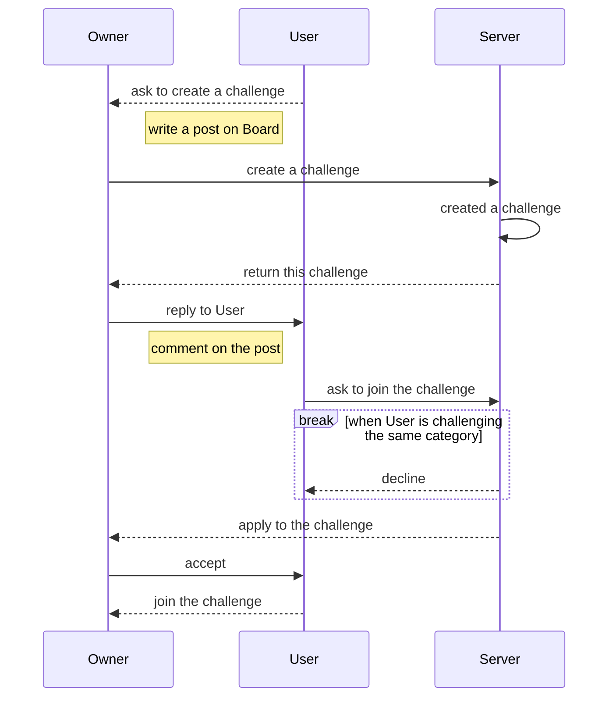
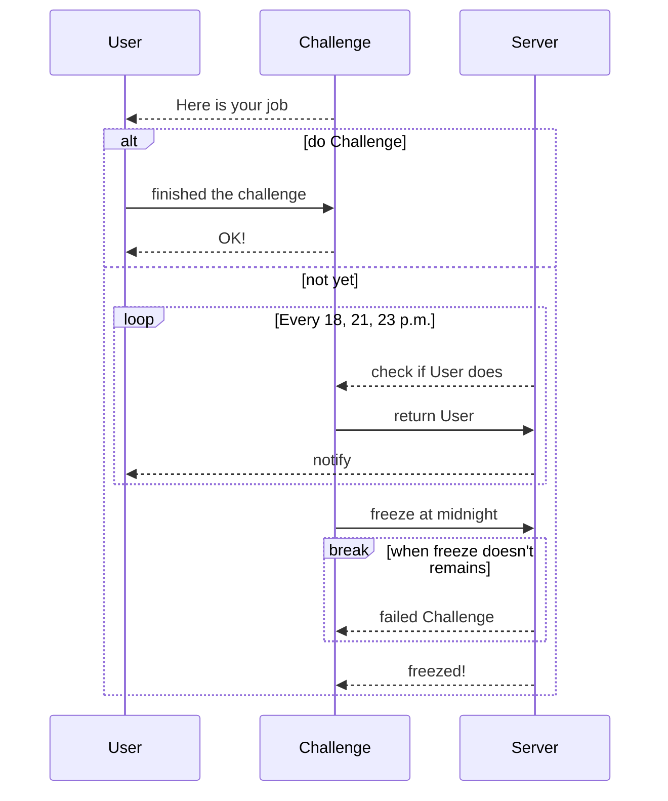

# 66 days : 개발자 습관 만들기

Content

1. 프로젝트 소개
1. 프로젝트 구조도
1. ERD
1. 유저 흐름도
1. 주요 기능
1. 시연
1. 팀원 역할
1. 회고

## 1. 프로젝트 소개

> 개발자에게는 꾸준한 학습과 바른 습관이 필요하다. 이를 돕고자 바른 습관 만들기라는 목표로 이 서비스를 기획했다. 습관이 생성 되기 위해서 평균 66일이라는 시간이 소요된다. 훌륭한 개발자가 되기 위해 66 days 동안 바른 습관을 만들어 보자.

- 2023/4/10 ~ 2023/5/19
- SSAFY 8기 자율 프로젝트

## 2. 프로젝트 구조도

## 3. ERD

## 4. 유저 흐름도

- 그룹에 참여하는 순서

- 챌린지에 참여하는 순서

- 챌린지 진행 순서

## 5. 주요 기능

- 개인 습관 등록
  - 개발자 개인은 66일 동안 습관으로 만들고 싶은 도전과제를 등록하여 매일 체크합니다. 
- 그룹 습관 등록
  - 개인으로 습관을 등록하고 도전할 수 있지만 타인과 함께 서로 감시/감독하며 하고 싶다면 그룹에 참여하여 같은 도전을 함께 진행할 수 있습니다.
- 채팅
  - 타인과 한 습관 도전과제를 하기로 하고 팀을 꾸렸다면 해당 소그룹 내에서 서로 실시간 채팅을 할 수 있습니다.
- 알림
  - 매일 도전을 이어 나가야하며 만약 체크되지 않을 시 유저에게 알림이 갑니다(18시, 21시, 23시)
- 포인트, 경험치
  - 유저는 스트릭을 이어가고 66일간의 습관 만들기 도전이 완료될 때마다 포인트와 경험치를 얻게 됩니다
- 상점
  - 유저는 자신의 아바타 및 마이페이지를 꾸미기 위한 오브젝트와 하루 도전을 하지 않았을 시 이를 방어할 수 있는 개인 프리즈를 상점에서 구매할 수 있습니다.
- 랭킹
  - 개인별 연속 스트릭 일수, 경험치량, 완료한 습관 수 별로 서비스 내 전체 유저 랭킹을 제공합니다.

## 6. 시연

To be continued

## 7. 팀원 역할

- **B.E**

  | 팀원   | 역할                           | 이메일                  | Github                        |
  | ------ | ------------------------------ | ----------------------- | ----------------------------- |
  | 권성은 | CI/CD, SpringBoot 설계 및 개발 | sungeun.kweon@gmail.com | https://github.com/hellowco   |
  | 김진호 | SpringBoot 설계 및 개발        | isagkim@gmail.com       | https://github.com/No88888888 |
  | 박귀렬 | DB 설계 및 관리                | ~~메일 없음~~           | https://github.com/willow2150 |

- **F.E**

  | 팀원      | 역할                                | 이메일            | Github                        |
  | --------- | ----------------------------------- | ----------------- | ----------------------------- |
  | 김태원 👑 | 팀장, 프론트 관리 및 개발           | taw4654@gmail.com | https://github.com/DanKim0213 |
  | 손예지    | 디자인, 공통 layout 개발 및 QA      | yllydev@gmail.com | https://github.com/yezgoget   |
  | 성다연    | 디자인, 화면 퍼블리싱 및 React 개발 | sdy32@naver.com   | https://github.com/dysung32   |

- 권성은

  - Java 및 Springboot를 활용한 REST API 구현
  - Docker 및 Jenkins를 활용한 CI/CD 구축
  - AWS EC2 및 Nginx 서버 관리
  - MSA 설계
  - 포팅 메뉴얼 문서화

- 박귀렬

  - DB 설계, 백엔드 API 구현

- 김진호

  - MVC 디자인 패턴에 맞춘 서버 구조 설계
  - Spring Boot를 활용한 REST API 설계
  - 통신 효율성을 높이기 위해 도메인 별 서비스 설계

- 성다연

  - TypeScript를 적용하여 정적 타입 문법 활용
  - 컴포넌트 재사용성 증진을 위한 컴포넌트 공통화
  - Styled Component와 Ant Design을 활용한 스타일 관리
  - Figma를 활용한 UI 디자인 및 프로토타이핑
  - 캐러셀 라이브러리 react-slick 활용

- 김태원

  - Notion과 Markdown 활용하여 팀 프로젝트 기획 및 설계 문서화
  - Github flow을 바탕으로 팀 프로젝트 코드 관리
  - Gitlab Issue에서 프론트엔드 팀의 코드 리뷰
  - TypeScript를 도입하여 프론트엔드 코드 안정성 확보
  - 그룹 인트로 페이지 퍼블리싱
  - 카카오 소셜 로그인 구현
  - 전역 상태 관리 툴인 [Zustand](https://github.com/pmndrs/zustand)를 활용하여 Authentication 로직 구현

- 손예지
  - ChartJs를 활용한 데이터 시각화
  - 컴포넌트 재사용성 증진을 위한 컴포넌트 공통화
  - Styled-components의 Themeprovider을 활용한 공통 스타일 속성 관리
  - 디자인 및 QA 진행

## 8. 회고

 💡 Goal : 이 프로젝트를 통해 이루고 싶었던 것

- 권성은: MSA에 대한 공부, 설계 및 개발
- 김진호: 스프링부트의 공부 및 CRUD 개발
- 박귀렬: 성능, 안정성, 확장성을 모두 갖춘 원활한 서비스 구축
- 김태원: 프로젝트 일정 조율 및 전체적인 안목을 기르고 싶었다.
- 성다연: 타입스크립트를 사용한 개발
- 손예지: 완성도 있는 프로젝트

💡 Keep : 잘하고 있는 점. 계속 했으면 좋겠다 싶은 점.

- 노션을 소통의 창구로서 모두에게 필요한 정보만을 보였다.
- 매일 아침 스크럼 미팅
- 오후에 다같이 하는 산책

 💡 Problem : 뭔가 문제가 있다 싶은 점. 변화가 필요한 점 

- 구체적으로 일정을 조율하지 못했다 (김태원)
  - 내 자신을 너무 믿었다. 내가 너무 오만했다. by 권성은
  - 권성은이 백엔드를 너무 소홀히 했다. 뭔 MSA야 백엔드부터하지!
- 기능명세서를 뽑아놓고 API 명세서와 연관짓지 않았다 ↓
  - API 명세서를 자세히 짜지 않아 프론트와 백간의 소통 문제가 발생하고 정확한 API가 나오지 못했다 (모두)
- 백엔드 간의 소통의 부재 (권성은, 김진호, 박귀렬, 김태원)
  - 일일 단위로 서로 무엇을 어디까지 했는가를 자세히 공유하지 않음
  - 영역을 자세히 나누지 않았고 누군가 못할 경우 다른 누가 커버하지 정하지 않았음
- 팀이 수용하지 못하는 기술 (e.g. Mongodb, MSA)를 사용했다.
- 무늬 스크럼 미팅
  - 스크럼 미팅 때 각자 뭐하는지 말만하고 서로 귀담아 듣지 않았다
  - 실제로 그 업무가 진행되고 있는지 확인하지 않았다

 💡 Try : 잘하고 있는 것을 더 잘하기 위해서, 문제가 있는 점을 해결하기 위해서 우리가 시도해 볼 것들

- 팀원과 협의 하에 개발 기간 약속을 하고, 완수하지 못한다면 바로 쳐내야한다.
- API 자동화 test 를 통해 명세서에 빠진 부분을 즉각 반영할 수 있도록 한다.
- 설계에 맞는 개발 기간을 잡고 그에 따른 git활용 및 개발 진척도를 공유하도록 한다.
- 1일 1커밋 및 코드리뷰를 통한 프로젝트 진척도 체크

